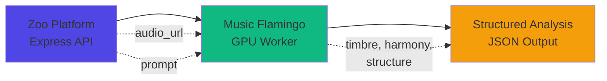

## Overview

[Music Flamingo](https://research.nvidia.com/labs/adlr/MF/) is NVIDIA's 8B parameter Large Audio-Language Model specifically designed for music understanding. It provides capabilities that standard LLMs lack - actual audio comprehension with music theory grounding.

<Info>
**License:** Commercial agreement with NVIDIA required for production use. Contact NVIDIA for licensing terms.
</Info>

---

## Capabilities

<CardGroup cols={2}>
  <Card title="Harmonic Analysis" icon="music">
    Detect chords, progressions, key, and music theory concepts
  </Card>
  <Card title="Timbre Description" icon="sliders">
    Describe instrument character, synthesis type, and tonal qualities
  </Card>
  <Card title="Structure Detection" icon="layer-group">
    Identify verse, chorus, bridge, and song sections
  </Card>
  <Card title="Long-form Processing" icon="clock">
    Analyze up to 20 minutes of audio with timestamp awareness
  </Card>
</CardGroup>

### Model Specifications

| Component | Details |
|-----------|---------|
| Parameters | 8B |
| Base LLM | Qwen2.5-7B |
| Audio Encoder | AF-Whisper unified encoder |
| Special Feature | Rotary Time Embeddings (RoTE) for timestamp awareness |
| Max Audio Input | 20 minutes (10 min practical) |
| Max Text Output | 2,048 tokens |

---

## Architecture

Music Flamingo runs on dedicated GPU infrastructure, separate from the main Zoo API:



### Deployment Options

| Option | Cost/Hour | Latency | Best For |
|--------|-----------|---------|----------|
| **Replicate** | ~$0.50/min | 5-15s | MVP / Prototyping |
| **Modal** | ~$2.50/hr active | 3-10s | Variable load |
| **RunPod** | ~$1.50/hr | 2-5s | Consistent load |
| **Self-hosted A100** | $15K+/mo | 1-3s | Production scale |

<Tip>
**Recommendation:** Start with Replicate for MVP validation. Move to Modal or RunPod once you hit 100+ daily analyses.
</Tip>

---

## Zoo Experiment Integrations

### Preset Detective

**Current:** Text descriptions + basic FFT analysis
**With Music Flamingo:** Deep audio understanding with synthesis type identification

<Tabs>
  <Tab title="What It Adds">
    - Identify synthesis method (analog, FM, wavetable, granular)
    - Describe exact timbre characteristics
    - Detect processing chain (filtering, distortion, modulation)
    - Match audio to preset database with high accuracy
  </Tab>
  <Tab title="Example Output">
    ```json
    {
      "synthesis": {
        "type": "analog subtractive",
        "confidence": 0.89
      },
      "timbre": {
        "brightness": 0.3,
        "warmth": 0.8,
        "description": "Warm, thick bass with subtle pulse width modulation"
      },
      "envelope": {
        "attack": "medium",
        "sustain": "sustained",
        "character": "pad-like with slow filter sweep"
      },
      "processing": ["low-pass filtered", "subtle chorus", "tape saturation"]
    }
    ```
  </Tab>
  <Tab title="New Tool">
    ```typescript
    {
      name: "analyze_audio_deep",
      description: "Deep AI analysis of audio using Music Flamingo",
      parameters: {
        audioUrl: string,
        startTime?: number,
        duration?: number  // Max 10s for preset analysis
      }
    }
    ```
  </Tab>
</Tabs>

---

### Mix Analyzer

**Current:** FFT spectrum + genre reference comparison
**With Music Flamingo:** Holistic mix evaluation with instrument-level feedback

<Tabs>
  <Tab title="What It Adds">
    - Identify individual instruments and their issues
    - Describe frequency masking between specific elements
    - Provide music-theory grounded feedback
    - Suggest fixes with specific plugin settings
  </Tab>
  <Tab title="Example Output">
    ```
    FREQUENCY BALANCE:
    - The bass guitar (playing root notes) and kick drum
      are masking each other around 80-100Hz
    - Vocal clarity reduced by guitar in 2-4kHz range

    DYNAMICS:
    - Snare lacks punch - over-compressed during tracking
    - Overall dynamic range appropriate for rock genre

    SPECIFIC FIXES:
    1. Side-chain compress bass to kick (3dB, fast release)
    2. Cut 3kHz on rhythm guitar by 2dB
    3. Parallel compress snare for punch without losing dynamics

    SUGGESTED PLUGINS:
    - API 2500 for bass/kick side-chain
    - Neve 1073 for guitar mid cut
    - 1176 for parallel snare compression
    ```
  </Tab>
  <Tab title="New Tool">
    ```typescript
    {
      name: "analyze_mix_full",
      description: "Complete mix analysis with Music Flamingo",
      parameters: {
        audioUrl: string,
        referenceGenre?: string,
        focusAreas?: ["frequency", "dynamics", "stereo", "instruments"]
      }
    }
    ```
  </Tab>
</Tabs>

---

### Sound Finder

**Current:** Curated database of 50-100 iconic sounds
**With Music Flamingo:** Real-time audio analysis of any reference track

<Tabs>
  <Tab title="What It Adds">
    - Analyze any moment in any song
    - Identify exactly how a sound was created
    - Provide step-by-step recreation guide
    - No pre-curated database required
  </Tab>
  <Tab title="Example Flow">
    **User:** "Analyze the bass at 1:23 in this track"

    **Music Flamingo:**
    ```
    SOUND ANALYSIS (1:23-1:33):

    This is an 808-style bass with heavy processing:

    SYNTHESIS:
    - Sub-oscillator (sine wave) at fundamental
    - Square wave one octave up, mixed low
    - Pitch envelope with fast decay (creates "808 thump")

    PROCESSING:
    - Aggressive sidechain compression to kick
    - Soft-knee saturation adding harmonics
    - High-pass at 30Hz (keeps it tight)
    - Stereo widening on harmonics only (bass stays mono)

    RECREATION:
    1. Start with Moog Minimoog "Sub Bass" preset
    2. Add pitch envelope: -12 semitones, 50ms decay
    3. Layer with "808 Tape" preset from Oxide
    4. Process through Studer A800 for saturation
    5. Sidechain with API 2500 (4:1, fast attack, medium release)
    ```
  </Tab>
  <Tab title="New Tool">
    ```typescript
    {
      name: "analyze_reference_moment",
      description: "Analyze specific timestamp in a reference track",
      parameters: {
        audioUrl: string,
        timestamp: number,      // Seconds
        duration?: number,      // Default 10s
        elementFocus?: string   // "bass", "synth", "drums", etc.
      }
    }
    ```
  </Tab>
</Tabs>

---

### Session Setup

**Current:** Text description to template
**With Music Flamingo:** Analyze reference track to generate intelligent session setup

<Tabs>
  <Tab title="What It Adds">
    - Detect all instruments in reference track
    - Identify production style and era
    - Generate complete session template
    - Suggest routing and plugin chains per track
  </Tab>
  <Tab title="Example Output">
    **User uploads:** Billie Eilish reference track

    **Music Flamingo:**
    ```
    REFERENCE ANALYSIS:
    - Genre: Dark pop / Alt-pop
    - Era influence: 2019-present bedroom pop
    - Key characteristics: Intimate, bass-heavy, minimal

    DETECTED ELEMENTS:
    - Whispered lead vocal (heavily processed)
    - Sub bass (808 style)
    - Finger snaps / minimal percussion
    - Ambient textures
    - Backing vocal layers (pitch shifted)

    SUGGESTED SESSION TEMPLATE:

    TRACKS:
    1. Lead Vocal (mono) → Neve 1073 → LA-2A → Lexicon 224
    2. Sub Bass (mono) → Oxide Tape → API 2500
    3. Percussion Bus (stereo) → SSL E Channel
    4. Ambience (stereo) → Ocean Way Studios
    5. Vocal Stack (stereo) → Chorus → Plate Reverb

    ROUTING:
    - All to Mix Bus → SSL Bus Comp → Studer A800
    - Parallel reverb bus for vocals

    MONITORING:
    - Low end critical - use subwoofer or good headphones
    - Check on phone speaker (this style translates to small speakers)
    ```
  </Tab>
</Tabs>

---

## Implementation

### Client Setup

<CodeGroup>
```typescript music-flamingo.ts
import Replicate from 'replicate';

const replicate = new Replicate({
  auth: process.env.REPLICATE_API_TOKEN
});

export async function analyzeMusicFlamingo(
  audioUrl: string,
  prompt: string,
  options: {
    startTime?: number;
    duration?: number;
    enableThinking?: boolean;
  } = {}
): Promise<string> {
  const fullPrompt = options.enableThinking
    ? `<think>\nAnalyzing this audio carefully...\n</think>\n\n${prompt}`
    : prompt;

  const output = await replicate.run(
    "nvidia/music-flamingo:latest",
    {
      input: {
        audio: audioUrl,
        prompt: fullPrompt,
        start_time: options.startTime || 0,
        duration: Math.min(options.duration || 30, 600),
        max_new_tokens: 1024
      }
    }
  );

  return String(output);
}
```

```typescript preset-analysis.ts
import { analyzeMusicFlamingo } from './music-flamingo';

export async function analyzeForPresetMatch(audioUrl: string) {
  const prompt = `Analyze this audio to identify the sound:

1. TIMBRE: Brightness (0-10), warmth (0-10), texture
2. ENVELOPE: Attack, decay, sustain, release characteristics
3. SYNTHESIS: Type (analog, FM, wavetable, sampled), confidence
4. PROCESSING: All audible effects
5. CATEGORY: bass, lead, pad, keys, fx, drums

Be specific and technical.`;

  const response = await analyzeMusicFlamingo(audioUrl, prompt, {
    duration: 10,
    enableThinking: true
  });

  return parsePresetAnalysis(response);
}
```

```typescript mix-analysis.ts
import { analyzeMusicFlamingo } from './music-flamingo';

export async function analyzeMix(audioUrl: string, genre?: string) {
  const prompt = `Analyze this mix as a professional mixing engineer.
${genre ? `Target genre: ${genre}` : ''}

Evaluate:
1. FREQUENCY BALANCE: Low, mid, high issues and fixes
2. DYNAMICS: Compression, punch, dynamic range
3. STEREO: Width, balance, phase issues
4. INSTRUMENTS: Quality of each element
5. TOP 3 FIXES: Most impactful improvements

Be specific with frequencies and dB amounts.`;

  return await analyzeMusicFlamingo(audioUrl, prompt, {
    duration: 180,
    enableThinking: true
  });
}
```
</CodeGroup>

### Audio Upload Handling

```typescript
// Handle user audio uploads securely
router.post('/upload-for-analysis', async (req, res) => {
  const { filename, contentType } = req.body;

  // Validate format
  const allowed = ['audio/wav', 'audio/mp3', 'audio/mpeg', 'audio/flac'];
  if (!allowed.includes(contentType)) {
    return res.status(400).json({ error: 'Invalid audio format' });
  }

  // Generate presigned upload URL
  const key = `analysis/${req.userId}/${Date.now()}-${filename}`;
  const uploadUrl = await getPresignedUploadUrl(key, contentType);

  // Schedule deletion after 1 hour (don't store user audio)
  await scheduleAudioDeletion(key, 3600);

  res.json({ uploadUrl, audioUrl: getPublicUrl(key) });
});
```

---

## Cost Estimates

| Operation | Audio Duration | GPU Time | Cost |
|-----------|---------------|----------|------|
| Preset analysis | 5-10s | ~10s | $0.08 |
| Mix analysis | 2-3 min | ~45s | $0.38 |
| Reference moment | 10-15s | ~15s | $0.13 |
| Full track catalog | 3-4 min | ~90s | $0.75 |

### Monthly Projections

<Tabs>
  <Tab title="MVP (100 DAU)">
    - 2 analyses per user per day
    - 200 analyses/day × $0.20 avg = **$40/day**
    - **~$1,200/month**
  </Tab>
  <Tab title="Growth (1000 DAU)">
    - 3 analyses per user per day
    - 3,000 analyses/day × $0.25 avg = **$750/day**
    - **~$22,500/month**
  </Tab>
  <Tab title="Scale (10K DAU)">
    - Consider self-hosted A100s at this scale
    - Break-even vs Replicate: ~5,000 analyses/day
    - Self-hosted: **~$15-20K/month** (fixed)
  </Tab>
</Tabs>

---

## Comparison: With vs Without

| Capability | Without Music Flamingo | With Music Flamingo |
|------------|----------------------|---------------------|
| Timbre description | Basic FFT features | "Warm Moog-style bass with PWM" |
| Synthesis ID | None | "FM synthesis, 3:1 ratio, bright carrier" |
| Harmonic analysis | Key detection only | Full chord progression + voice leading |
| Mix feedback | Generic frequency bands | "The snare at 1:23 masks the vocal 's' sounds" |
| Processing ID | None | "LA-2A style opto compression, 3dB GR" |
| Reference matching | Text search only | Audio-to-audio similarity |

---

## Implementation Roadmap

<Steps>
  <Step title="Week 1: Infrastructure">
    Deploy Music Flamingo worker on Replicate, set up audio upload pipeline
  </Step>
  <Step title="Week 2: Preset Detective">
    Integrate `analyze_audio_deep` tool, A/B test vs basic FFT
  </Step>
  <Step title="Week 3: Mix Analyzer">
    Add `analyze_mix_full` tool, build genre reference comparisons
  </Step>
  <Step title="Week 4: Validation">
    Measure accuracy improvement, cost per analysis, user satisfaction
  </Step>
  <Step title="Week 5-6: Sound Finder">
    Add reference moment analysis, expand to full track cataloging
  </Step>
</Steps>

---

## Resources

<CardGroup cols={2}>
  <Card title="Music Flamingo Paper" icon="file-lines" href="https://research.nvidia.com/labs/adlr/MF/">
    NVIDIA Research publication and demos
  </Card>
  <Card title="HuggingFace Model" icon="face-smile" href="https://huggingface.co/nvidia/music-flamingo-hf">
    Model weights and usage examples
  </Card>
  <Card title="Audio Flamingo 3" icon="github" href="https://github.com/NVIDIA/audio-flamingo">
    Base model and training code
  </Card>
  <Card title="Cog Container" icon="docker" href="https://github.com/zsxkib/cog-nvidia-audio-flamingo-3">
    Production-ready container for deployment
  </Card>
</CardGroup>
