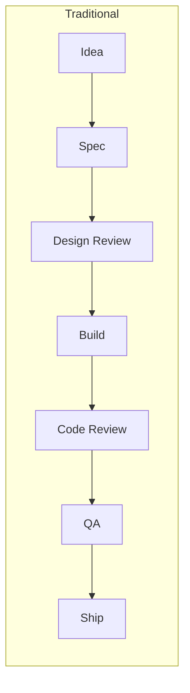
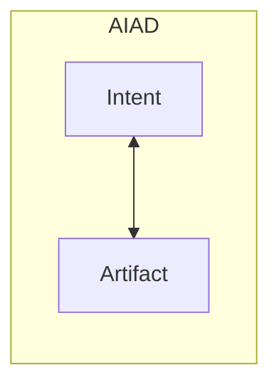

## The Death of Sequential Process

Traditional software process exists because of **latency** - the gap between intent and artifact:



Each gate exists because **changing the artifact is expensive**. You review designs before building because building is slow. You review code before merging because fixing is costly. Process is a hedge against the cost of iteration.

## The AIAD Collapse

When creation becomes real-time dialog with AI, these gates collapse:



**The review *is* the creation.** You don't spec → review → build. You converse with the artifact directly:

- "Make this button more prominent" → *it changes*
- "That broke the layout" → *it fixes*
- "Actually, let's try a different approach" → *it pivots*

The feedback loop is so tight that traditional review becomes meaningless. What would you review? The conversation is the review.

## Process Still Exists - But It's Different

AIAD doesn't eliminate process. It transforms it:

| Traditional Process | AIAD Process |
|---------------------|--------------|
| Review before build | Dialog during build |
| Approve the spec | Manipulate the artifact |
| Gate before next phase | Continuous refinement |
| Scheduled checkpoints | Organic convergence |
| Committee decides | Creator + AI iterate |

### What Remains

<AccordionGroup>
  <Accordion title="Intent Clarification" icon="bullseye">
    You still need to know what you're building. But instead of writing specs that get reviewed, you **explore intent through prototypes**.

    "Build me a vocal recording interface" → see result → "No, simpler" → see result → "Yes, that direction"

    The prototype *is* the spec.
  </Accordion>

  <Accordion title="Quality Judgment" icon="check">
    Humans still decide "is this good enough?" But the judgment happens **in the moment**, not in a review meeting next week.

    You look at it. You ship it or you keep iterating. No ceremony required.
  </Accordion>

  <Accordion title="Architectural Decisions" icon="sitemap">
    Big structural choices still matter. "Should we use React Native or native Swift?" can't be A/B tested in real-time.

    But even here, AIAD compresses the cycle: prototype both in a day, feel the difference, decide.
  </Accordion>

  <Accordion title="User Feedback" icon="users">
    The ultimate review is still users. Ship fast, watch metrics, iterate.

    AIAD just means you can respond to feedback in hours instead of sprints.
  </Accordion>
</AccordionGroup>

## The New Workflow

### Before: Waterfall with Agile Lipstick

```
Monday: Sprint planning (2 hours)
Tuesday-Thursday: Build
Friday: Code review, QA
Next Monday: Retro, planning again
Repeat for 6 sprints
Ship something
```

### After: Continuous Dialog

```
Morning: "Here's what I'm thinking" → prototype exists
Midday: "Users are saying X" → iterate
Afternoon: Ship to beta
Tomorrow: "Metrics show Y" → adjust
Repeat daily
```

The unit of work isn't the sprint. It's the **conversation turn**.

## What This Means for UA Labs

### No Design Reviews

Don't schedule meetings to review designs. **Show the working thing.** If it's wrong, change it while everyone watches.

The "review" is: does this feel right? Yes → ship. No → iterate now.

### No Code Reviews (Traditional)

Code review as gate-keeping is dead. The AI already reviewed it. You already iterated on it through conversation.

What remains:
- **Pair programming** (human + AI, or human + human + AI)
- **Post-hoc learning** ("here's what I shipped, here's what I learned")
- **Architecture discussions** (before major structural changes)

### No Handoffs

In traditional process, you hand off: design → eng → QA → ops.

In AIAD, the same person (Builder + AI) takes intent to production. No handoffs means no handoff meetings, no handoff documentation, no handoff delays.

### No Roadmaps Beyond 8 Weeks

Roadmaps exist because execution is slow and change is expensive. When you can build anything in days, why plan months ahead?

Plan the experiment. Run it. Learn. Plan the next one.

## The New Rituals

AIAD still has rituals, but they serve different purposes:

<Tabs>
  <Tab title="Daily Standup Video">
    **Not:** "Yesterday I did X, today I'll do Y, blockers Z"

    **Instead:** 60-second screen recording showing what you shipped. Posted publicly. The artifact speaks for itself.
  </Tab>
  <Tab title="Weekly Demo">
    **Not:** Slideshow of what we plan to build

    **Instead:** Live walkthrough of working software. Users can try it. Feedback happens in real-time. Iteration might happen during the demo.
  </Tab>
  <Tab title="8-Week Fill/Kill">
    **Not:** Project review with status updates

    **Instead:** Binary decision based on metrics. Does it work? Ship or kill. No extended deliberation.
  </Tab>
</Tabs>

## The Mindset Shift

Traditional process assumes:
- **Building is hard** → review before building
- **Changing is expensive** → get it right the first time
- **Coordination is necessary** → meetings, approvals, gates

AIAD assumes:
- **Building is cheap** → build to think
- **Changing is free** → iterate constantly
- **Individuals can ship** → trust, don't coordinate

<Note>
The goal isn't to eliminate all process. It's to eliminate process that exists **because execution was slow**.

What remains is the irreducible core: knowing what to build, judging if it's good, and learning from users.
</Note>

## Summary

| Old World | New World |
|-----------|-----------|
| Process hedges against iteration cost | Iteration is free |
| Review before build | Dialog during build |
| Spec → Review → Build → Review → Ship | Intent ↔ Artifact (continuous) |
| Sprints | Conversation turns |
| Handoffs | Single owner + AI |
| Roadmaps | 8-week experiments |

**The design review collapsed into a singularity: dialog with the design itself.**
