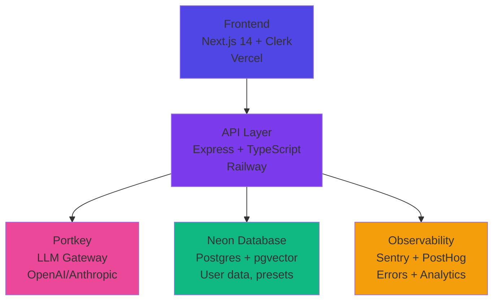
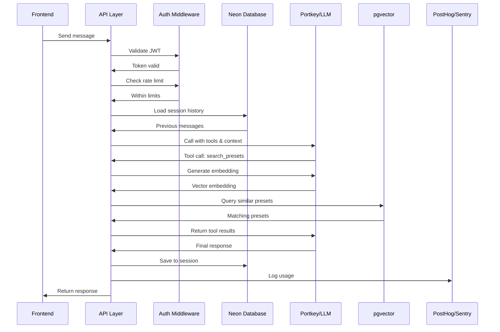

## Platform Philosophy

Zoo is designed for **rapid experimentation** with production-grade infrastructure from day 1. No technical debt, no refactoring needed as you scale.

<Info>
**Goal:** Ship MVPs in 1 week, validate in 8 weeks, scale only what works
</Info>

---

## High-Level Architecture



---

## Core Components

### Frontend (Next.js 14)

<CardGroup cols={2}>
  <Card title="Framework" icon="react">
    **Next.js 14** with App Router
    - React Server Components
    - API routes for proxying
    - Static generation where possible
  </Card>
  <Card title="Authentication" icon="lock">
    **Clerk** for auth
    - Social login (Google, GitHub)
    - JWT-based sessions
    - User metadata sync
  </Card>
  <Card title="UI" icon="palette">
    **Tailwind CSS** for styling
    - Component library (Headless UI)
    - Responsive design
    - Dark mode support
  </Card>
  <Card title="State" icon="arrows-rotate">
    **React Query** for data fetching
    - Caching and invalidation
    - Optimistic updates
    - Loading states
  </Card>
</CardGroup>

**Deployment:** Vercel (auto-deploy from Git)

---

### Backend (Express + TypeScript)

<CardGroup cols={2}>
  <Card title="API Framework" icon="server">
    **Express** with TypeScript
    - RESTful endpoints
    - Middleware stack
    - Error handling
  </Card>
  <Card title="Validation" icon="shield-check">
    **Zod** for runtime validation
    - Type-safe schemas
    - Request/response validation
    - Environment variables
  </Card>
  <Card title="Rate Limiting" icon="gauge">
    **express-rate-limit**
    - Per-user limits
    - Tier-based (free/pro)
    - Prevents abuse
  </Card>
  <Card title="Security" icon="lock">
    **Helmet** for security headers
    - CORS configuration
    - JWT verification
    - SQL injection prevention
  </Card>
</CardGroup>

**Deployment:** Railway (auto-deploy from Git)

---

### Database (Neon Postgres)

**Why Neon:**
- Serverless Postgres (auto-scaling)
- Built-in pgvector for semantic search
- Branch-based development
- Generous free tier

**Schema Design:**

<Tabs>
  <Tab title="Users & Auth">
```sql
-- Synced from Clerk
users (
  id, clerk_user_id, email,
  tier, owned_plugins, preferences
)
```
  </Tab>
  <Tab title="Presets">
```sql
-- Core content
presets (
  id, plugin_id, preset_name,
  description, tags,
  characteristics (JSONB),
  embedding (vector 1536)
)
```
  </Tab>
  <Tab title="Sessions">
```sql
-- Conversation history
sessions (
  id, user_id, experiment_id,
  messages (JSONB),
  metadata (JSONB)
)
```
  </Tab>
  <Tab title="Analytics">
```sql
-- Usage tracking
llm_calls (usage, cost, latency)
user_actions (clicks, feedback)
```
  </Tab>
</Tabs>

---

### AI/LLM Layer

**Portkey Gateway:**
- Routes requests to OpenAI or Anthropic
- Automatic fallbacks if primary fails
- Caching for identical requests
- Built-in observability

**Models:**

| Use Case | Primary | Fallback | Cost |
|----------|---------|----------|------|
| Chat/Reasoning | GPT-4o-mini | Claude 3.5 Sonnet | Around 0.15 per 1M tokens |
| Embeddings | text-embedding-ada-002 | - | Around 0.10 per 1M tokens |
| Audio Analysis | GPT-4o | Claude 3.5 Sonnet | Around 5.00 per 1M tokens |

**Vector Search:**
- pgvector for semantic similarity
- Cosine distance for ranking
- IVFFlat index for speed

---

### Observability

<CardGroup cols={2}>
  <Card title="Error Tracking" icon="bug">
    **Sentry**
    - Exception capture
    - Stack traces
    - User context
    - Performance monitoring
  </Card>
  <Card title="Product Analytics" icon="chart-line">
    **PostHog**
    - Event tracking
    - User journeys
    - Feature flags
    - Session replay
  </Card>
</CardGroup>

**Key Metrics:**
- API latency (p50, p95, p99)
- LLM call success rate
- Cost per session
- User retention (Day 1, 7, 30)
- Error rates by endpoint

---

## Data Flow

### Chat Message Flow



**Latency Budget:**
- Frontend → API: Less than 50ms
- API → Neon: Less than 20ms
- API → Portkey → LLM: 500-2000ms
- Vector search: Less than 50ms
- **Total: 1-3 seconds**

---

## Security Considerations

<Warning>
**Authentication:**
- All API endpoints require valid JWT
- Clerk handles token issuance and refresh
- No API keys exposed to frontend

**Data Privacy:**
- User conversations encrypted at rest
- Audio files deleted after analysis
- Only feature vectors stored, not raw audio
- GDPR-compliant data deletion

**Rate Limiting:**
- Free tier: 10 requests/hour
- Pro tier: 100 requests/hour
- Prevents abuse and controls costs
</Warning>

---

## Scaling Strategy

### MVP (Weeks 1-8)

**Current stack is sufficient for:**
- 100-1000 users
- 10K requests/day
- Cost: Around 100-300 per month

### Production (Months 3-6)

**Add when needed:**
- Redis for caching
- Background job queue (Bull/Temporal)
- CDN for static assets
- Database read replicas

### Scale (6+ months)

**Only if multiple experiments succeed:**
- Microservices architecture
- Kubernetes for orchestration
- Dedicated vector database (Pinecone/Qdrant)
- Multi-region deployment

<Info>
**Philosophy:** Don't scale prematurely. Add complexity only when current solution becomes a bottleneck.
</Info>

---

## Cost Breakdown

### Infrastructure (Per Month)

| Service | Free Tier | Paid Tier | At Scale |
|---------|-----------|-----------|----------|
| Neon | 0 | 25 | 100+ |
| Railway | 5 | 20 | 100+ |
| Vercel | 0 | 20 | 150+ |
| Clerk | 0 | 25 | 200+ |
| Portkey | 0 | 50 | 200+ |
| Sentry | 0 | 0 | 80+ |
| PostHog | 0 | 0 | 200+ |
| **Total** | **5** | **140** | **1000+** |

### Variable Costs (Per 1000 Sessions)

| Cost Center | Per Session | Per 1000 Sessions |
|-------------|-------------|-------------------|
| LLM (GPT-4o-mini) | 0.02-0.05 | 20-50 |
| Embeddings | 0.01 | 10 |
| Database | 0.001 | 1 |
| **Total** | **0.03-0.06** | **30-60** |

---

## Development Workflow

### Local Development

```bash
# Frontend
cd zoo-frontend
npm run dev  # localhost:3000

# Backend
cd zoo-platform
npm run dev  # localhost:3001

# Database
# Use Neon staging branch
```

### Deployment

**Automatic on push to main:**
1. GitHub push triggers Railway (backend)
2. GitHub push triggers Vercel (frontend)
3. Neon production branch used
4. Sentry release tracking
5. PostHog deployment event

### Monitoring

**Daily checks:**
- Error rate in Sentry
- Cost per session in Portkey dashboard
- User retention in PostHog
- Database usage in Neon console

---

## Next Steps

<CardGroup cols={2}>
  <Card title="Quick Start Guide" icon="bolt" href="/zoo/quick-start">
    Build platform in 5 days
  </Card>
  <Card title="Preset Detective" icon="magnifying-glass" href="/zoo/experiments/preset-detective">
    Complete implementation guide
  </Card>
</CardGroup>
