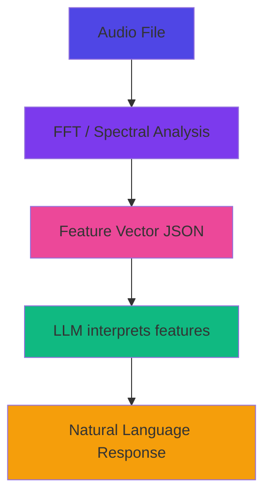

## Overview

These are **consumer-facing music applications** for musicians, producers, and audio professionals - not internal tools or generic AI assistants.

<Info>
Each experiment is designed for an 8-week "fill or kill" validation cycle with clear success metrics.
</Info>

---

## Selection Framework

<CardGroup cols={3}>
  <Card title="High ROI" icon="dollar-sign">
    Direct revenue through plugin sales, subscriptions, or retained users
  </Card>
  <Card title="Fast Validation" icon="bolt">
    Text-only MVP in Week 1, add audio processing only if validated
  </Card>
  <Card title="UA Moat" icon="shield">
    Leverages UAD plugins, Apollo hardware, or exclusive music domain knowledge
  </Card>
</CardGroup>

---

## Priority Experiments

### 1. Preset Detective (Recommended First)

**What it does:** AI assistant that helps musicians discover UAD presets

**User flow:**
- User: "I need a warm analog bass for synthwave"
- AI: Recommends 3-5 specific presets with detailed reasoning
- User clicks preset, sees purchase link if not owned

**Why start here:**
- **Clear ROI**: Plugin/preset sales (50-200K/year potential)
- **Fast MVP**: Text-only in Week 1, add audio analysis Week 4-6
- **Simple validation**: Recommendations helpful or not?

**Technical approach:**
- pgvector for semantic preset search
- OpenAI embeddings for preset characteristics
- LLM for natural language understanding

**Success metrics:**
- 65%+ find recommendations helpful
- 30%+ Day 7 retention
- 10%+ click through to purchase

<Card title="Start Building" icon="play" href="/zoo/experiments/preset-detective">
  Complete Day 1-5 implementation guide
</Card>

---

### 2. Mix Analyzer

**What it does:** Analyzes mixes and provides specific feedback on improvements

**User flow:**
- Producer uploads rough mix
- AI analyzes: frequency balance, dynamics, stereo field, loudness
- Returns specific feedback: "Your mix has excessive 200-400Hz energy (muddiness). Try cutting 3dB at 300Hz on bass and guitar"
- Suggests UAD plugins/settings to fix issues

**Why this experiment:**
- **High demand**: Everyone wants better mixes
- **Freemium model**: 3 analyses/month free, unlimited paid
- **Clear value**: Specific, actionable feedback

**Technical approach:**
- Server-side audio analysis (FFT, loudness, stereo correlation)
- Compare against reference mixes in same genre
- LLM translates technical metrics to musical language

**Challenges:**
- Audio processing is compute-intensive (0.10-0.50 per minute)
- "Good" is subjective and genre-dependent
- Need reference database of professional mixes

**Success metrics:**
- 60%+ find feedback actionable
- 40%+ upload revised mix (engaged)
- 20%+ convert free to paid

---

### 3. Preset Generator

**What it does:** Generates synth presets from natural language descriptions

**User flow:**
- Producer: "Create me a warm analog bass, thick, slightly distorted"
- AI generates preset parameters for their synth
- User can tweak or regenerate
- Saves as custom preset

**Why this experiment:**
- **Increases plugin value**: Makes synthesizers easier to use
- **Natural interface**: No knob-twiddling required
- **Viral potential**: Users share generated presets

**Technical approach:**
- LLM maps musical descriptions to synthesis parameters
- Start with one synth (Moog Minimoog)
- JSON parameter output, no audio generation in MVP

**Challenges:**
- Need plugin SDK integration (may not be available)
- "Warm" means different things on different synths
- Can't actually hear the sound without audio playback

**Success metrics:**
- 50%+ like generated presets
- 40%+ save the preset (validation)
- 30%+ regenerate/refine (engaged)

---

### 4. Smart Session Setup

**What it does:** Auto-configures DAW session based on what user is recording

**User flow:**
- Producer: "I'm recording acoustic guitar and vocals"
- AI creates: tracks with correct I/O, plugins (EQ/comp), monitoring, effects sends
- Ready to record in 30 seconds vs 20 minutes manual setup

**Why this experiment:**
- **Time savings**: 5-20 minutes per session
- **LUNA differentiator**: Deep DAW integration
- **Retention driver**: Makes workflow faster

**Technical approach:**
- Detect available hardware (Apollo interface, I/O count)
- Generate DAW-specific template configuration
- Apply via DAW scripting API (LUNA easiest)

**Challenges:**
- Requires DAW API integration (complex)
- Different DAWs have different capabilities
- Users may prefer their custom templates

**Success metrics:**
- 70%+ setup is correct/usable
- 60%+ use it regularly
- 5+ minutes saved per session (measured)

---

### 5. Sound Finder

**What it does:** Helps users recreate sounds from reference tracks

**User flow:**
- Producer: "I want a bass like Billie Eilish's 'Bad Guy'"
- AI explains: "Distorted 808 bass with aggressive sidechain compression"
- Shows UAD plugins that can create it
- Links to tutorials if available

**Why this experiment:**
- **Plugin discovery**: Users buy plugins to recreate sounds
- **Educational value**: Builds loyalty, positions UA as expert
- **Easier than audio analysis**: Text-based knowledge database

**Technical approach:**
- Curated database of iconic sounds (50-100 to start)
- LLM provides production technique explanations
- Links to UAD plugins + tutorials

**Challenges:**
- Database doesn't exist (need to manually create)
- Can't use copyrighted audio for demos
- Keeping database current (new songs daily)

**Success metrics:**
- 65%+ "That's the right sound/technique"
- 45%+ try to recreate the sound
- 30%+ successful recreation (subjective)

---

### 6. Tone Explorer

**What it does:** Educational tool that teaches musicians how to build iconic guitar tones using signal chains

**User flow:**
- Musician browses tone categories (Clean Jazz, Warm Blues, Classic Rock, etc.)
- Clicks to hear 10-second demo
- Sees complete signal chain breakdown: plugin names, parameter settings, and "why" explanations
- Clicks "Get these plugins" to purchase via affiliate links

**Why this experiment:**
- **Zero infrastructure**: Static HTML/CSS/JS - can build in 2-4 days
- **Education-first**: Builds trust and positions as expert
- **Affiliate revenue**: Direct plugin sales commissions (20-30%)
- **Fast validation**: Track demo plays, explanation reads, click-throughs

**Technical approach:**
- MVP: Static site with 5 pre-recorded tones, JSON data, simple JavaScript
- Level 2: Add Web Audio API for interactive parameter tweaking
- Level 3: Add AI to generate custom signal chains from text descriptions
- Level 4: Full platform with user accounts, community, try-before-buy

**Challenges:**
- Audio quality in browser (WebAssembly needed for realism)
- Plugin licensing and affiliate partnerships
- Tone is subjective - need diverse testing

**Success metrics:**
- 60%+ play audio demos
- 40%+ read educational explanations
- 10%+ click through to purchase

<Card title="Start Building" icon="guitar" href="/zoo/experiments/tone-explorer">
  Complete 4-day implementation guide with code examples
</Card>

---

## Music vs Generic AI

| Aspect | Generic AI | Music AI |
|--------|-----------|----------|
| **Input** | Text | Audio + text |
| **Latency** | 1-3s OK | Less than 2s critical |
| **Accuracy** | 80% OK | 95%+ required (musicians notice) |
| **Cost/call** | $0.01-0.10 | $0.10-1.00 (audio processing) |
| **Moat** | Prompt engineering | Audio analysis + domain knowledge |
| **Validation** | User feedback | A/B listening tests |

---

## Technical Considerations

### Audio Processing

**Latency budget:**
- Real-time tools (mix analyzer): Less than 2 seconds
- Batch tools (preset generator): Less than 10 seconds

**Audio quality:**
- Input: 44.1kHz minimum, 24-bit preferred
- Processing: Full-bandwidth (don't truncate to MP3)

**Cost:**
- Server-side DSP: $0.10-0.50 per minute processed
- Client-side when possible (WebAudio API)

### Feature Extraction Pipeline

### Privacy and Legal

**Strategy:**
- Process audio, extract features, delete audio immediately
- Store features only (JSON, less than 1KB)
- Don't train on copyrighted audio without license

---

## Next Steps

<CardGroup cols={2}>
  <Card title="Start with Preset Detective" icon="play" href="/zoo/experiments/preset-detective">
    Follow the complete Week 1 implementation guide
  </Card>
  <Card title="8-Week Process" icon="calendar" href="/zoo/process/eight-week-cycle">
    Understand the fill-or-kill validation framework
  </Card>
</CardGroup>
