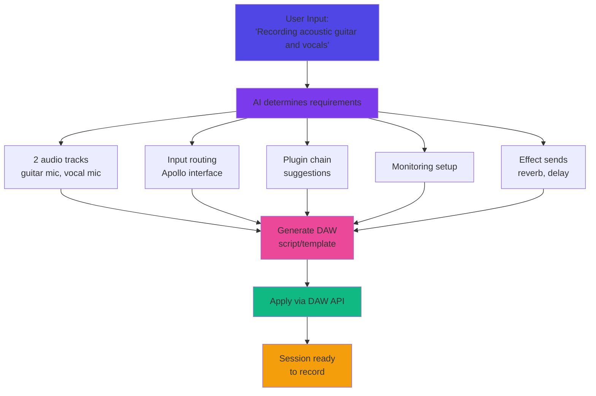

## Overview

Automatically configures DAW sessions based on what the user is recording, saving 5-20 minutes of manual setup per session.

**User Flow:**
- Producer: "I'm recording acoustic guitar and vocals"
- AI creates: tracks with correct I/O, plugins (EQ/comp), monitoring, effects sends
- Ready to record in 30 seconds vs 20 minutes manual setup

---

## Why This Experiment?

<CardGroup cols={3}>
  <Card title="Time Savings" icon="clock">
    5-20 minutes saved per session, multiple times per day
  </Card>
  <Card title="LUNA Differentiator" icon="star">
    Deep DAW integration gives Universal Audio unique advantage
  </Card>
  <Card title="Retention Driver" icon="arrows-rotate">
    Makes workflow faster, increases daily usage
  </Card>
</CardGroup>

---

## Technical Approach

### How It Works



### Session Configuration

**AI Determines:**
- **Track count** - How many instruments?
- **I/O routing** - Which Apollo inputs/outputs?
- **Plugin chains** - EQ, compression, de-esser?
- **Monitoring** - Headphone mix, cue sends?
- **Effects** - Reverb, delay buses?
- **Track naming** - Logical, organized names?

---

## Example Configurations

<Tabs>
  <Tab title="Acoustic Guitar + Vocals">
**User Input:** "Recording acoustic guitar and vocals"

**AI Creates:**
```
Track 1: "Acoustic Guitar"
- Input: Apollo Input 1
- Plugins: Neve 1073 (EQ), LA-2A (compression)
- Send 1: Reverb Bus (20%)

Track 2: "Lead Vocal"
- Input: Apollo Input 2
- Plugins: Precision De-Esser, API 2500 (compression), Neve 1073 (EQ)
- Send 1: Reverb Bus (30%)
- Send 2: Delay Bus (15%)

Aux Track: "Reverb"
- Plugin: Lexicon 224
- Output: Master

Aux Track: "Delay"
- Plugin: Galaxy Tape Echo
- Output: Master

Monitoring:
- Headphone mix enabled
- Low-latency monitoring active
```
  </Tab>

  <Tab title="Full Band">
**User Input:** "Recording full band - drums, bass, two guitars, vocals"

**AI Creates:**
```
Drum Group (8 tracks):
- Kick In, Kick Out, Snare Top, Snare Bottom
- Tom 1, Tom 2, Tom 3
- Overhead L, Overhead R
- Plugins: Neve 1073 (all), API 2500 (drum bus)

Track: "Bass DI"
- Input: Apollo Input 9 (DI)
- Plugins: LA-2A, Neve 1073

Track: "Guitar 1"
- Input: Apollo Input 10
- Plugins: UAD Amp simulation

Track: "Guitar 2"
- Input: Apollo Input 11
- Plugins: UAD Amp simulation

Track: "Lead Vocal"
- Plugins: De-esser, 1176, Neve 1073

Mix Bus:
- API 2500 (glue compression)
```
  </Tab>

  <Tab title="Podcast/Interview">
**User Input:** "Recording podcast with 3 people"

**AI Creates:**
```
Track 1: "Host"
- Input: Apollo Input 1
- Plugins: Precision De-Esser, EQ, Compressor
- Noise gate enabled

Track 2: "Guest 1"
- Input: Apollo Input 2
- Plugins: Precision De-Esser, EQ, Compressor
- Noise gate enabled

Track 3: "Guest 2"
- Input: Apollo Input 3
- Plugins: Precision De-Esser, EQ, Compressor
- Noise gate enabled

Routing:
- All to stereo master
- Individual headphone mixes
- Recording format: 44.1kHz, 24-bit
```
  </Tab>
</Tabs>

---

## Challenges

<Warning>
**DAW API Required:** Need deep integration with LUNA or other DAW

**Hardware Detection:** Must detect available Apollo interface and I/O configuration

**User Preferences:** Some users prefer their own templates and workflows

**Complex Sessions:** Full orchestras or complex productions may be too variable
</Warning>

---

## Success Metrics

### Week 4 (Alpha)

| Metric | Target |
|--------|--------|
| Setup is correct/usable | 70%+ |
| Use it regularly | 60%+ |
| Time saved per session | More than 5 minutes |

### Week 8 (Fill or Kill)

| Metric | Fill Threshold | Kill Below |
|--------|---------------|------------|
| Day 7 Retention | More than 40% | Less than 20% |
| Weekly usage | More than 3 sessions | Less than 1 session |
| NPS | More than 40 | Less than 10 |
| Time saved (measured) | More than 5 min | Less than 2 min |

---

## Implementation Plan

<Steps>
  <Step title="Week 1-2: MVP">
    - LUNA integration only (easier API)
    - Detect Apollo interface model
    - 5-10 common session types
    - Basic I/O routing
  </Step>
  <Step title="Week 3-4: Alpha">
    - Add plugin recommendations
    - Custom monitoring setups
    - 10-15 internal users (LUNA + Apollo)
    - Measure time savings
  </Step>
  <Step title="Week 5-6: Beta">
    - More session types (20+)
    - User custom preferences
    - Save session templates
    - 50-100 users
  </Step>
  <Step title="Week 7-8: Decision">
    - Calculate actual time saved
    - Measure regular usage
    - Fill or kill
  </Step>
</Steps>

---

## DAW Integration Requirements

**Need from UAD:**
- LUNA API/scripting access
- Create tracks programmatically
- Set I/O routing
- Insert plugins with parameters
- Create aux sends/busses
- Access to Apollo interface detection

**Ideal:**
- Console integration (apply to any DAW)
- Preset recall via hardware
- Cross-DAW templates (export to Pro Tools, Logic, etc.)

---

## Cost Estimates

**Infrastructure:**
- LLM calls: Around 0.02-0.05 per session setup
- No audio processing required
- Minimal storage

**Expected Usage (Month 1):**
- 300 session setups
- LLM: Around 10-15
- **Total: Around 10-20 per month**

**ROI Calculation:**
- Time saved: 10 min per session × 300 sessions = 50 hours
- At 50 per hour value = 2,500 in productivity
- Infrastructure cost: 20
- **ROI: 125x**

---

## When to Build This

<Info>
**Recommendation:** Build as **4th experiment** after validating discovery and analysis tools

**Reasoning:**
- Requires DAW API access (complex partnership)
- LUNA-only limits addressable market initially
- High value but requires hardware ecosystem
- Better after proving AI platform value
</Info>

---

## Next Steps

<CardGroup cols={2}>
  <Card title="View All Experiments" icon="flask" href="/zoo/experiments/overview">
    Explore other music AI experiments
  </Card>
  <Card title="8-Week Process" icon="calendar" href="/zoo/process/eight-week-cycle">
    Review the fill-or-kill framework
  </Card>
</CardGroup>
