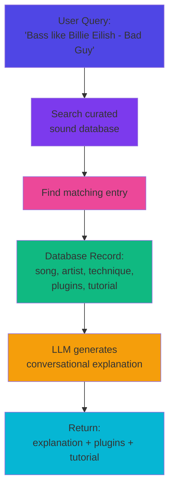

## Overview

Helps users recreate sounds from reference tracks by explaining production techniques and recommending UAD plugins.

**User Flow:**
- Producer: "I want a bass like Billie Eilish's 'Bad Guy'"
- AI explains: "Distorted 808 bass with aggressive sidechain compression"
- Shows UAD plugins that can create it
- Links to tutorials if available

---

## Why This Experiment?

<CardGroup cols={3}>
  <Card title="Plugin Discovery" icon="compass">
    Users buy plugins to recreate sounds they love
  </Card>
  <Card title="Educational Value" icon="graduation-cap">
    Builds loyalty, positions UA as expert resource
  </Card>
  <Card title="Easier Than Audio" icon="bolt">
    Text-based knowledge database, no complex audio analysis
  </Card>
</CardGroup>

---

## How It Works

### Knowledge Base Approach



### Database Structure

**Sound Database (50-100 to start):**
- Iconic bass sounds (20)
- Famous vocal chains (15)
- Signature drum sounds (15)
- Guitar tones (10)
- Synth leads (10)
- Special effects (10)

**Each Entry Contains:**
- Song/Artist reference
- Element (bass, vocals, drums, etc.)
- Production technique description
- Equipment used (original)
- UAD plugin equivalents
- Step-by-step recreation guide
- Tutorial video links (if available)

---

## Example Interactions

<Tabs>
  <Tab title="Billie Eilish Bass">
**User:** "I want a bass like Billie Eilish's 'Bad Guy'"

**AI Response:**
```
The bass in "Bad Guy" is a heavily processed 808 kick/bass hybrid.

Technique:
1. Start with deep 808 bass (use Roland Jupiter-8 or Moog Minimoog)
2. Aggressive distortion/saturation
3. Sidechain compression triggered by kick
4. High-pass filter around 30Hz to avoid mud

UAD Plugin Chain:
1. Moog Minimoog - Bass oscillator preset
2. Culture Vulture - Aggressive saturation
3. 1176 - Fast attack/release for sidechain pumping
4. Neve 1073 - High-pass filter at 30Hz

Settings:
- 1176: Attack 1, Release 7, Ratio 4:1
- Sidechain triggered by kick drum
- Saturation drive around 60%

Tutorial: [Link to video breakdown]
```
  </Tab>

  <Tab title="Drake Vocals">
**User:** "How do I get Drake's vocal sound?"

**AI Response:**
```
Drake's vocal production (particularly "Hotline Bling" era) features:

Characteristics:
- Warm, close-mic'd sound
- Heavy compression (very consistent level)
- Subtle auto-tune (natural sounding)
- Short plate reverb
- Slight telephone/lo-fi character

UAD Plugin Chain:
1. Neve 1073 - Warmth and presence boost
   - High shelf +3dB at 10kHz
   - Mid boost +2dB at 3kHz
2. LA-2A - Smooth optical compression
   - Peak reduction to taste (GR 3-6dB)
3. 1176 - Additional fast compression
   - Attack 3, Release 5, Ratio 4:1
4. Auto-Tune (if available)
   - Retune speed around 20ms
5. EMT 140 Plate Reverb
   - Mix 15%, decay 1.2s

Mic technique: Very close (3-6 inches), pop filter essential
```
  </Tab>

  <Tab title="808 Kick">
**User:** "How do I make an 808 kick that hits hard?"

**AI Response:**
```
The classic hard-hitting 808 kick heard in trap and hip-hop:

Source:
- Roland TR-808 kick drum (use sample or Spark Drum Machine)
- Tune to key of song (usually root note)

Processing Chain:
1. Precision Multiband - Separate sub from click
   - Low band: boost +3dB (20-80Hz)
   - Mid band: boost +2dB (2-5kHz) for click
2. Culture Vulture - Add harmonic distortion
   - Triode mode, drive 30-40%
3. Studer A800 - Tape saturation
   - 30ips, +3 input level
4. API 2500 - Parallel compression
   - Aggressive settings, blend 30-40%

Mixing:
- High-pass everything else above 60Hz
- Sidechain bass to kick for separation
- Don't over-compress the master

Common mistakes to avoid:
- Too much sub (causes muddiness)
- Not tuning to key (creates dissonance)
- Over-distorting (loses punch)
```
  </Tab>
</Tabs>

---

## Challenges

<Warning>
**Database Doesn't Exist:** Need to manually create and curate sound library

**Copyright Issues:** Can't use actual audio for demos without licensing

**Keeping Current:** New songs and trends emerge daily

**Subjective Nature:** "Drake's sound" varies across albums and producers
</Warning>

---

## Success Metrics

### Week 4 (Alpha)

| Metric | Target |
|--------|--------|
| "That's the right sound" | 65%+ |
| Try to recreate | 45%+ |
| Successful recreation | 30%+ (subjective) |

### Week 8 (Fill or Kill)

| Metric | Fill Threshold | Kill Below |
|--------|---------------|------------|
| Day 7 Retention | More than 30% | Less than 15% |
| Plugin purchase intent | More than 15% | Less than 5% |
| NPS | More than 35 | Less than 10 |
| Database coverage | 100+ sounds | Less than 50 sounds |

---

## Implementation Plan

<Steps>
  <Step title="Week 1-2: MVP">
    - Curate 20-30 iconic sounds
    - Text-based database (JSON)
    - LLM generates explanations
    - No audio examples yet
  </Step>
  <Step title="Week 3-4: Alpha">
    - Expand to 50 sounds
    - Add plugin preset downloads
    - Tutorial video links
    - 10-15 internal testers
  </Step>
  <Step title="Week 5-6: Beta">
    - 100+ sounds in database
    - User-contributed sounds (moderated)
    - Audio examples (licensed or created)
    - 50-100 external users
  </Step>
  <Step title="Week 7-8: Decision">
    - Measure plugin purchases
    - User satisfaction
    - Fill or kill
  </Step>
</Steps>

---

## Database Creation Strategy

### Initial 20-30 Sounds (Week 1)

**Bass Sounds (8):**
- Billie Eilish - "Bad Guy" (808)
- Daft Punk - "Around the World" (synth bass)
- Rage Against the Machine - "Killing in the Name" (distorted bass)
- Parliament - "Flash Light" (Moog bass)

**Vocal Chains (6):**
- Drake (warm, compressed)
- Billie Eilish (intimate, breathy)
- Adele (powerful, present)
- T-Pain (auto-tune, vocoder)

**Drum Sounds (6):**
- Phil Collins - "In the Air Tonight" (gated reverb)
- Amen Break (jungle/DNB)
- 808 trap kick
- Motown snare

**Synth/Lead (5):**
- Van Halen - "Jump" (synth brass)
- Stranger Things theme (retro synth)
- Blade Runner soundtrack (Vangelis pads)

### Crowdsourcing (Week 4+)

- Users submit sounds they want to recreate
- Community votes on priority
- Expert producers create guides
- Moderation for quality

---

## Cost Estimates

**Database Creation:**
- Expert time: 30 min per sound × 100 sounds = 50 hours
- At 100 per hour = 5,000 initial investment

**Infrastructure:**
- LLM calls: Around 0.02 per query
- Storage: Minimal (text database)

**Expected Usage (Month 1):**
- 400 queries
- LLM: Around 8
- **Total: Around 10 per month ongoing**

**ROI:**
- Plugin purchase conversion: 15% of users
- 400 users × 15% = 60 purchases
- Average order value: 200
- Revenue: 12,000
- Cost: 5,010
- **ROI: 2.4x in Month 1**

---

## When to Build This

<Info>
**Recommendation:** Build as **2nd or 3rd experiment** alongside or after Preset Detective

**Reasoning:**
- Complements preset discovery well
- Lower technical complexity (no audio processing)
- Clear ROI through plugin sales
- Database creation is time-intensive but straightforward
</Info>

---

## Next Steps

<CardGroup cols={2}>
  <Card title="View All Experiments" icon="flask" href="/zoo/experiments/overview">
    Explore other music AI experiments
  </Card>
  <Card title="8-Week Process" icon="calendar" href="/zoo/process/eight-week-cycle">
    Review the fill-or-kill framework
  </Card>
</CardGroup>
