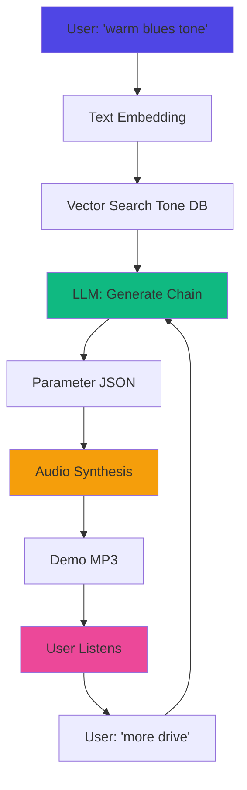

## Mission

Build a simple, static web app that educates musicians on how iconic guitar tones are created. Start with 5 preset tones, expand based on engagement.

**Target:** "How do I get warm blues tone?" → See signal chain breakdown with educational explanations

---

## Why Start Here?

<CardGroup cols={3}>
  <Card title="Zero Infrastructure" icon="rocket">
    Static HTML/CSS/JS - no backend, database, or auth required
  </Card>
  <Card title="2-4 Day Build" icon="clock">
    MVP can be built and deployed in a weekend
  </Card>
  <Card title="Clear Metrics" icon="chart-simple">
    Do people play demos? Do they read explanations? Do they click affiliate links?
  </Card>
</CardGroup>

---

## Progression Path

### Level 1: Static Tone Library (MVP - Start Here)

**User flow:**
1. Browse 5 preset tone categories (Clean Jazz, Warm Blues, Classic Rock, Modern Metal, Surf Rock)
2. Click to hear demo (10-second pre-recorded audio)
3. See signal chain breakdown with plugin names, settings, and educational "why"
4. Click "Get these plugins" → affiliate links

**What you need:**
- 5 pre-recorded audio demos (MP3)
- tones.json with tone recipes
- Simple HTML/CSS/JS frontend
- GitHub Pages for hosting (free)

**Time to build:** 2-4 days
**Cost:** $0

---

### Level 2: Interactive Parameter Learning

**Added capabilities:**
- Adjust individual plugin parameters in real-time (Web Audio API)
- Hear how changes affect the tone
- A/B comparison between variations
- Visual signal flow diagram
- Before/after waveform visualization

**Technical needs:**
- Web Audio API for basic effects
- Simple DSP implementations (gain, EQ, basic distortion)
- Real-time audio processing

**Time to add:** 1-2 weeks
**Cost:** $0 (still static hosting)

---

### Level 3: AI-Powered Tone Generation

**User flow:**
1. Input text description: "warm vintage blues tone", "aggressive modern metal"
2. AI generates signal chain with specific plugins and parameter recommendations
3. Demo the generated tone (audio synthesis)
4. Provide feedback to refine: "more distortion", "less bass"
5. Export as shopping cart for actual plugins

**AI Architecture:**
```
User Description
    ↓
Embedding Model (text → vector)
    ↓
RAG Database (tone recipes, plugin characteristics)
    ↓
LLM Reasoning (chain construction + parameter selection)
    ↓
Audio Synthesis (demo generation)
    ↓
Feedback Loop (user refinement)
```

**Technical needs:**
- LLM integration (GPT-4, Claude)
- Vector database (Pinecone, Weaviate) for tone embeddings
- Plugin parameter database with semantic descriptions
- Audio synthesis engine (approximates plugin behavior)

**Time to add:** 4-6 weeks
**Cost:** $50-200/month (LLM + vector DB)

---

### Level 4: Full Platform with Commerce

**Added features:**
- User accounts: Save favorites, share presets
- Community: Upload custom chains, vote on tones
- Try before buy: Browser-based plugin demos (WebAssembly)
- Integrated checkout: Partner with Plugin Alliance, Waves, UAD
- Learning paths: Genre-specific courses, plugin deep-dives

**Monetization:**
- Affiliate commissions (20-30% from plugin sales)
- Premium subscription (unlimited AI generations)
- Course sales
- API access for DAW integration

**Time to build:** 3-4 months
**Cost:** $200-500/month

---

## MVP Implementation (Level 1)

### File Structure

```
tone-explorer/
├── index.html              # Single page app
├── styles.css              # Simple styling
├── app.js                  # Minimal JS (~50 lines)
├── tones/
│   ├── tones.json         # Tone recipes
│   └── demos/             # Pre-recorded MP3s
│       ├── clean-jazz.mp3
│       ├── warm-blues.mp3
│       ├── classic-rock.mp3
│       ├── modern-metal.mp3
│       └── surf-rock.mp3
└── README.md
```

---

### Data Model (tones.json)

```json
{
  "tones": [
    {
      "id": "warm-blues",
      "name": "Warm Blues",
      "genre": "Blues",
      "description": "Smooth, singing sustain perfect for SRV-style leads",
      "demo_file": "demos/warm-blues.mp3",
      "signal_chain": [
        {
          "plugin_type": "Amp Sim",
          "name": "Fender Deluxe Reverb",
          "parameters": {
            "Gain": "4/10",
            "Tone": "6/10",
            "Volume": "7/10"
          },
          "why": "Clean foundation with slight breakup"
        },
        {
          "plugin_type": "Overdrive",
          "name": "Tube Screamer",
          "parameters": {
            "Drive": "3/10",
            "Tone": "7/10",
            "Level": "6/10"
          },
          "why": "Adds warmth and compression without harshness"
        },
        {
          "plugin_type": "Reverb",
          "name": "Spring Reverb",
          "parameters": {
            "Mix": "15%",
            "Decay": "1.2s"
          },
          "why": "Subtle ambience, keeps it intimate"
        }
      ],
      "plugins_needed": [
        {
          "name": "Neural DSP Archetype",
          "price": "$99",
          "affiliate_link": "https://neuraldsp.com/..."
        }
      ],
      "cost_estimate": "$99-299",
      "difficulty": "Beginner"
    }
  ]
}
```

---

### Core HTML Structure

<CodeGroup>
```html index.html
<!DOCTYPE html>
<html lang="en">
<head>
    <meta charset="UTF-8">
    <meta name="viewport" content="width=device-width, initial-scale=1.0">
    <title>Tone Explorer - Learn Guitar Tones</title>
    <link rel="stylesheet" href="styles.css">
</head>
<body>
    <header>
        <h1>🎸 Tone Explorer</h1>
        <p>Learn how iconic guitar tones are built</p>
    </header>

    <main id="tone-grid">
        <!-- Dynamically populated from tones.json -->
    </main>

    <script src="app.js"></script>
</body>
</html>
```

```javascript app.js
// Load and render tones
fetch('tones/tones.json')
    .then(res => res.json())
    .then(data => renderTones(data.tones));

function renderTones(tones) {
    const grid = document.getElementById('tone-grid');
    tones.forEach(tone => {
        grid.appendChild(createToneCard(tone));
    });
}

function createToneCard(tone) {
    const card = document.createElement('div');
    card.className = 'tone-card';
    card.innerHTML = `
        <h2>${tone.name}</h2>
        <p class="genre">${tone.genre}</p>
        <audio controls>
            <source src="tones/${tone.demo_file}" type="audio/mpeg">
        </audio>
        <div class="signal-chain">
            <h3>Signal Chain</h3>
            ${tone.signal_chain.map((plugin, i) => `
                <div class="plugin">
                    <strong>${i + 1}. ${plugin.name}</strong>
                    <ul>
                        ${Object.entries(plugin.parameters).map(([k, v]) =>
                            `<li>${k}: ${v}</li>`
                        ).join('')}
                    </ul>
                    <p class="why">${plugin.why}</p>
                </div>
            `).join('')}
        </div>
        <a href="${tone.plugins_needed[0].affiliate_link}" class="buy-btn">
            Get Plugins (from ${tone.cost_estimate})
        </a>
    `;
    return card;
}
```

```css styles.css
* { margin: 0; padding: 0; box-sizing: border-box; }

body {
    font-family: -apple-system, BlinkMacSystemFont, 'Segoe UI', sans-serif;
    background: #0a0a0a;
    color: #fff;
    padding: 20px;
}

header {
    text-align: center;
    margin-bottom: 40px;
}

h1 {
    font-size: 2.5rem;
    margin-bottom: 10px;
}

#tone-grid {
    display: grid;
    grid-template-columns: repeat(auto-fit, minmax(350px, 1fr));
    gap: 30px;
    max-width: 1400px;
    margin: 0 auto;
}

.tone-card {
    background: #1a1a1a;
    border: 1px solid #333;
    border-radius: 12px;
    padding: 25px;
}

.tone-card h2 {
    color: #6366f1;
    margin-bottom: 5px;
}

.genre {
    color: #888;
    font-size: 0.9rem;
    margin-bottom: 15px;
}

audio {
    width: 100%;
    margin-bottom: 20px;
}

.signal-chain {
    background: #111;
    padding: 15px;
    border-radius: 8px;
    margin-bottom: 20px;
}

.plugin {
    margin-bottom: 15px;
    padding-bottom: 15px;
    border-bottom: 1px solid #222;
}

.plugin:last-child {
    border-bottom: none;
}

.plugin strong {
    color: #f59e0b;
    display: block;
    margin-bottom: 8px;
}

.plugin ul {
    list-style: none;
    margin: 8px 0;
    padding-left: 15px;
}

.plugin li {
    color: #aaa;
    font-size: 0.9rem;
    margin: 4px 0;
}

.why {
    font-style: italic;
    color: #666;
    font-size: 0.85rem;
    margin-top: 8px;
}

.buy-btn {
    display: block;
    background: #6366f1;
    color: white;
    text-align: center;
    padding: 12px;
    border-radius: 8px;
    text-decoration: none;
    font-weight: 600;
    transition: background 0.2s;
}

.buy-btn:hover {
    background: #4f46e5;
}
```
</CodeGroup>

---

## The 5 Starter Tones

<AccordionGroup>
  <Accordion title="Clean Jazz - Fender Twin Style">
    **Signal Chain:**
    1. Fender Twin Amp (Gain: 2/10, Tone: 7/10)
    2. Slight room reverb (10% mix)

    **Why it works:** Crystal clear headroom, no breakup, bright articulation
  </Accordion>

  <Accordion title="Warm Blues - SRV Style">
    **Signal Chain:**
    1. Fender Deluxe Reverb (Gain: 4/10)
    2. Tube Screamer (Drive: 3/10)
    3. Spring Reverb (15% mix)

    **Why it works:** Slight amp breakup + mild overdrive = warm sustain without harshness
  </Accordion>

  <Accordion title="Classic Rock - Marshall Crunch">
    **Signal Chain:**
    1. Marshall Plexi (Gain: 6/10)
    2. EQ boost at 2kHz (presence)
    3. Plate reverb (20% mix)

    **Why it works:** Natural amp distortion, presence boost cuts through mix
  </Accordion>

  <Accordion title="Modern Metal - High Gain">
    **Signal Chain:**
    1. High-gain amp head (Gain: 8/10)
    2. Noise gate (threshold: -40dB)
    3. Tight EQ (cut lows below 80Hz, cut highs above 8kHz)

    **Why it works:** Heavy saturation + tight gating = aggressive but controlled
  </Accordion>

  <Accordion title="Surf Rock - Spring Reverb">
    **Signal Chain:**
    1. Fender Reverb Amp (Gain: 3/10)
    2. Spring Reverb (60% mix, long decay)
    3. Slight tremolo (rate: 4Hz)

    **Why it works:** Clean tone + massive reverb = classic surf sound
  </Accordion>
</AccordionGroup>

---

## Creating Demo Audio Files

### Option 1: Record Yourself (Best Quality)

<Steps>
  <Step title="Download Free Plugins">
    - Amplitube Free (amp sims)
    - LePou plugins (free amp sims)
    - TAL Reverb (free reverb)
  </Step>
  <Step title="Record 10-Second Riffs">
    Record same riff through each tone setup
    - Use clean DI guitar input
    - Apply plugins in DAW
    - Export as 320kbps MP3
  </Step>
  <Step title="Optimize for Web">
    Keep files under 500KB each
    - 10 seconds max
    - 44.1kHz sample rate
    - Normalize to -1dB
  </Step>
</Steps>

### Option 2: Royalty-Free Samples

- Find guitar DI recordings on Splice, Loopmasters
- Process through free plugins
- Ensure license allows web distribution

### Option 3: AI Generation (Quick but Lower Quality)

- Use Suno/Udio to generate 10-second guitar clips
- Extract and trim to focus on tone
- Note: May sound synthetic, but works for proof-of-concept

---

## 4-Day Build Plan

<Steps>
  <Step title="Day 1: Data & Structure">
    - Create file structure
    - Write tones.json for 5 tones with complete signal chains
    - Create basic HTML shell

    **Time:** 3-4 hours
  </Step>

  <Step title="Day 2: Audio Demos">
    - Record or source 5 audio demos
    - Optimize for web (under 500KB each)
    - Test playback in browsers

    **Time:** 4-6 hours
  </Step>

  <Step title="Day 3: Frontend & Styling">
    - Write app.js to load and display tones
    - Create styles.css for responsive design
    - Add educational "why" explanations

    **Time:** 4-5 hours
  </Step>

  <Step title="Day 4: Polish & Deploy">
    - Test on mobile devices
    - Add affiliate links
    - Deploy to GitHub Pages
    - Share with musician communities

    **Time:** 2-3 hours
  </Step>
</Steps>

**Total time:** 13-18 hours over 4 days

---

## Deployment

### GitHub Pages (Free)

```bash
# Initialize git
git init
git add .
git commit -m "Initial Tone Explorer MVP"

# Create repo and push
gh repo create tone-explorer --public --source=. --push

# Enable GitHub Pages
gh repo edit --enable-pages --pages-branch main
```

Your app will be live at: `https://yourusername.github.io/tone-explorer`

### Alternative: Netlify or Vercel

- Drag and drop the folder
- Auto-deploy on git push
- Free SSL and CDN

---

## Success Metrics (Week 1)

<CardGroup cols={3}>
  <Card title="Engagement" icon="play">
    **Target:** 60%+ play audio demos

    Track with: Google Analytics events
  </Card>

  <Card title="Learning" icon="book">
    **Target:** 40%+ read "why" explanations

    Track with: Scroll depth, time on page
  </Card>

  <Card title="Conversion" icon="cart-shopping">
    **Target:** 10%+ click affiliate links

    Track with: UTM parameters
  </Card>
</CardGroup>

---

## Next Steps After MVP

### If Engagement is High (60%+ play demos):

<Steps>
  <Step title="Add 10 More Tones">
    Cover more genres: funk, country, indie, shoegaze, djent
  </Step>

  <Step title="Add Comparison Feature">
    Side-by-side tone comparison with A/B player
  </Step>

  <Step title="Add User Voting">
    "Which tone sounds better?" - collect preference data
  </Step>

  <Step title="Move to Level 2">
    Add interactive parameter controls with Web Audio API
  </Step>
</Steps>

### If Engagement is Low (Less than 40%):

<Warning>
Pivot or kill the experiment:
- Try video demos instead of audio-only
- Focus on one genre deeply instead of broad coverage
- Consider different format (interactive game, quiz)
- Document learnings and move to next experiment
</Warning>

---

## AI Integration Path (Level 3)

### When to Add AI:

<Check>MVP validated (60%+ engagement)</Check>
<Check>User requests for custom tones</Check>
<Check>10+ tones in library (training data)</Check>
<Check>Budget approved ($100-200/month)</Check>

### AI Features to Build:

<Tabs>
  <Tab title="Text-to-Tone Generation">
    **User Input:** "I want a warm, vintage rock tone with some grit"

    **AI Output:**
    ```json
    {
      "signal_chain": [
        {
          "plugin": "Marshall JTM45",
          "settings": {"gain": 5, "tone": 6}
        },
        {
          "plugin": "Tube Driver",
          "settings": {"drive": 4, "tone": 7}
        }
      ],
      "reasoning": "Marshall JTM45 provides vintage character..."
    }
    ```

    **Implementation:**
    - Use GPT-4 or Claude to interpret natural language
    - RAG database of plugin characteristics
    - Generate parameter recommendations
  </Tab>

  <Tab title="Tone Refinement">
    **User Feedback:** "Make it more aggressive"

    **AI Adjustment:**
    - Increase drive parameters
    - Add more gain staging
    - Tighten EQ
    - Re-synthesize demo

    **Implementation:**
    - Maintain conversation context
    - Apply semantic adjustments to parameters
    - Regenerate audio demo
  </Tab>

  <Tab title="Reverse Engineering">
    **User Input:** "Recreate the guitar tone from [song name]"

    **AI Output:**
    - Identify song from database
    - Describe tone characteristics
    - Suggest signal chain approximation
    - Link to tutorial if available

    **Implementation:**
    - Curated database of iconic tones (50-100 songs)
    - LLM retrieval from knowledge base
    - No copyrighted audio, just descriptions
  </Tab>
</Tabs>

---

## Technical Architecture (Level 3)



### Data Requirements

**Tone Embeddings Database:**
- 100+ tone recipes with embeddings
- Plugin parameter ranges and descriptions
- Genre associations
- Sonic characteristics (warm, bright, aggressive, etc.)

**Plugin Knowledge Base:**
- Parameter definitions
- Sonic impact of each parameter
- Typical use cases
- Price and availability

---

## Cost Breakdown

### Level 1 (Static MVP)

| Item | Cost |
|------|------|
| Development Time | 13-18 hours |
| Hosting (GitHub Pages) | $0 |
| Audio Recording | $0 (DIY) or $50 (freelancer) |
| **Total** | **$0-50** |

### Level 2 (Interactive)

| Item | Cost |
|------|------|
| Additional Development | 40-80 hours |
| Hosting | $0 (still static) |
| **Total** | **$0** |

### Level 3 (AI-Powered)

| Item | Cost/Month |
|------|------|
| OpenAI API (embeddings + GPT-4) | $50-100 |
| Vector DB (Pinecone) | $70 |
| Hosting (Railway/Vercel) | $20-50 |
| Audio synthesis (RunPod) | $50-100 |
| **Total** | **$190-320/month** |

---

## Differentiation from Existing Tools

### vs. Preset Packs:

- **Education-first:** Not just presets, but understanding WHY
- **Visual learning:** See signal chain diagrams
- **Curated quality:** Only iconic, proven tones

### vs. YouTube Tutorials:

- **Faster:** 30 seconds vs 15-minute video
- **Interactive:** Adjust parameters in real-time (Level 2+)
- **Searchable:** Natural language queries (Level 3)

### vs. Plugin Preset Browsers:

- **Cross-plugin:** See multiple plugins in chain context
- **Educational:** Learn signal flow and technique
- **AI-powered discovery:** Describe what you want (Level 3)

---

## Potential Challenges

<Warning>
**Audio Quality in Browser:**
- WebAssembly + AudioWorklet can approximate, but not perfect
- May sound different from actual plugins
- Manage expectations with disclaimers
</Warning>

<Warning>
**Plugin Licensing:**
- Can't use copyrighted preset names without permission
- Need partnerships or clean-room descriptions
- Affiliate links require agreements with manufacturers
</Warning>

<Warning>
**Subjective Quality:**
- "Good tone" is subjective and genre-dependent
- Need diverse user testing
- Build feedback loops for continuous improvement
</Warning>

---

## Next Steps

<CardGroup cols={2}>
  <Card title="Start Building MVP" icon="code">
    Create the basic file structure and tones.json
  </Card>

  <Card title="View Other Experiments" icon="flask" href="/zoo/experiments/overview">
    Explore other music AI experiments in the zoo
  </Card>

  <Card title="8-Week Process" icon="calendar" href="/zoo/process/eight-week-cycle">
    Understand the fill-or-kill validation framework
  </Card>

  <Card title="Deployment Guide" icon="rocket" href="/zoo/deployment/roadmap">
    Learn how to deploy and scale your experiment
  </Card>
</CardGroup>
